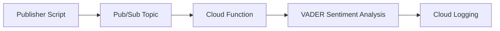

# Cloud Pulse Stream

## Overview

Cloud Pulse Stream is a real-time sentiment analysis inference pipeline designed using Google Cloud Platform services. The project processes incoming text messages through Google Cloud Pub/Sub and analyzes sentiment using the NLTK VADER sentiment analyzer inside a Google Cloud Function.

The solution follows an event-driven architecture where publishers send messages to a Pub/Sub topic and a serverless Cloud Function performs sentiment inference automatically.

## Features

* Real-time sentiment analysis
* Event-driven architecture
* Pub/Sub message ingestion
* Serverless processing with Cloud Functions
* NLTK VADER sentiment analysis
* Structured logging
* Error handling for malformed messages
* Unit testing with 93% coverage
* Environment variable configuration

---

## Architecture



---

## Project Structure

```text
cloud-pulse-stream
│
├── publisher.py
├── publisher_requirements.txt
├── sample_texts.json
├── README.md
│
├── sentiment_analyzer
│   ├── main.py
│   └── requirements.txt
│
└── tests
    └── test_sentiment.py
```

---

## Prerequisites

* Python 3.9+
* Google Cloud SDK
* Google Cloud Project
* Google Cloud Pub/Sub API
* Google Cloud Functions API
* Google Cloud Logging API

---

## GCP Authentication

Login:

```bash
gcloud auth login
```

Set project:

```bash
gcloud config set project YOUR_PROJECT_ID
```

---

## Enable APIs

```bash
gcloud services enable pubsub.googleapis.com
```

```bash
gcloud services enable cloudfunctions.googleapis.com
```

```bash
gcloud services enable cloudbuild.googleapis.com
```

```bash
gcloud services enable logging.googleapis.com
```

---

## Create Pub/Sub Resources

Create topic:

```bash
gcloud pubsub topics create sentiment-input
```

Create subscription:

```bash
gcloud pubsub subscriptions create sentiment-input-subscription --topic=sentiment-input --ack-deadline=10 --message-retention-duration=604800s
```

---

## Install Dependencies

Cloud Function:

```bash
pip install -r sentiment_analyzer/requirements.txt
```

Publisher:

```bash
pip install -r publisher_requirements.txt
```

---

## Cloud Function Deployment

```bash
gcloud functions deploy sentiment-analyzer-function ^
--runtime python39 ^
--trigger-topic sentiment-input ^
--entry-point process_pubsub_message ^
--memory 256MB ^
--set-env-vars GCP_PROJECT_ID=YOUR_PROJECT_ID
```

---

## Environment Variables

Publisher:

```text
GCP_PROJECT_ID
PUB_SUB_TOPIC_ID
```

Cloud Function:

```text
GCP_PROJECT_ID
```

---

## Running the Publisher

Windows CMD:

```cmd
set GCP_PROJECT_ID=YOUR_PROJECT_ID
```

```cmd
set PUB_SUB_TOPIC_ID=sentiment-input
```

```cmd
python publisher.py
```

---

## Sample Input

```json
{
  "id": "1",
  "text": "This product is absolutely amazing!"
}
```

---

## Sentiment Output Format

```json
{
  "text": "This product is absolutely amazing!",
  "sentiment_label": "POSITIVE",
  "sentiment_score": 0.85
}
```

---

## Running Unit Tests

```bash
python -m unittest tests.test_sentiment
```

---

## Coverage Report

```bash
python -m coverage run -m unittest tests.test_sentiment
```

```bash
python -m coverage report
```

Coverage achieved:

```text
TOTAL COVERAGE: 93%
```

---

## Error Handling

The Cloud Function handles:

* Missing Pub/Sub data
* Invalid JSON payloads
* Missing text fields
* Invalid input types
* Unexpected runtime exceptions

All errors are logged using Python logging.

---

## Deployment Note

The source code, unit tests, Pub/Sub integration logic, Cloud Function implementation, deployment commands, and infrastructure configuration have been fully prepared and validated locally.

Cloud Function deployment was not executed because the Google Cloud project did not have an active billing account attached, which is required by Cloud Build and Artifact Registry for deployment.

## Future Improvements

* Deploy using Cloud Functions Gen 2
* Add model versioning
* Store inference results in BigQuery
* Add monitoring dashboards
* Add CI/CD using GitHub Actions

---

## Author

Mohammed Shahid Ali Khan
